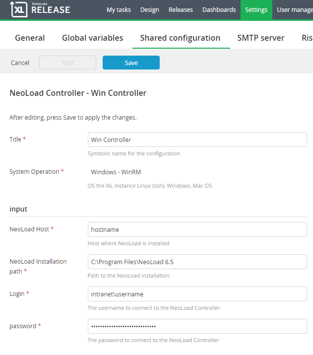
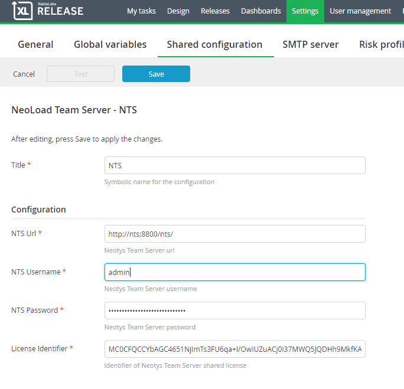
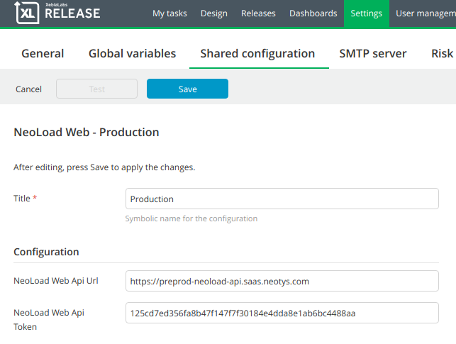
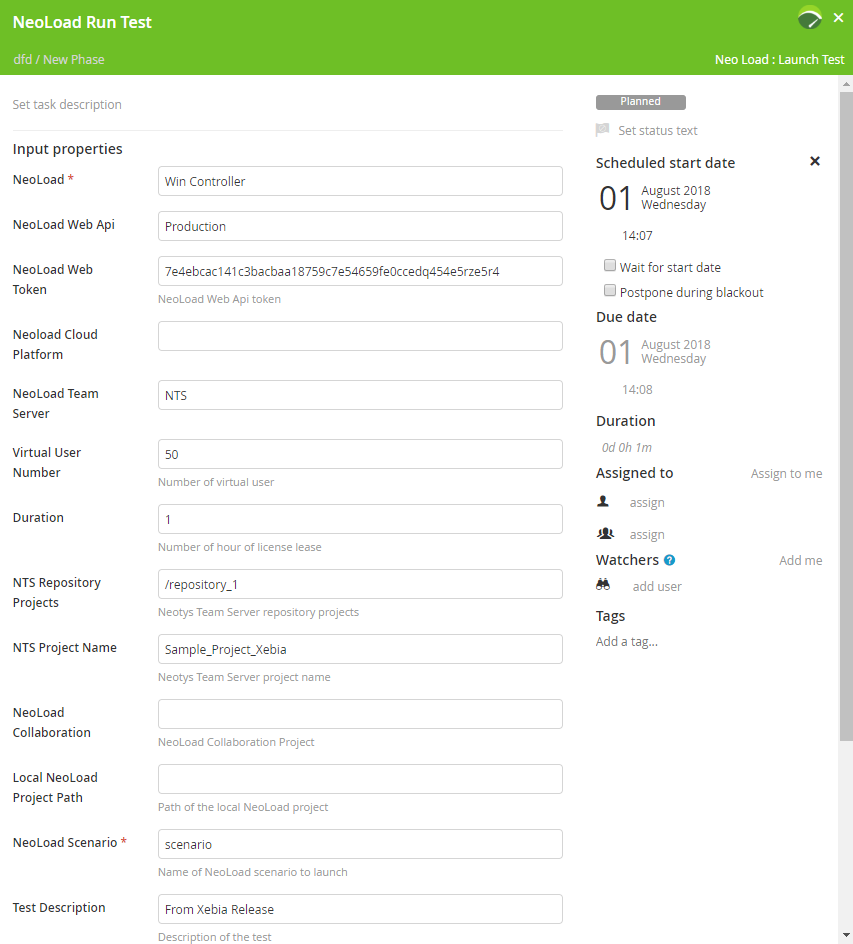
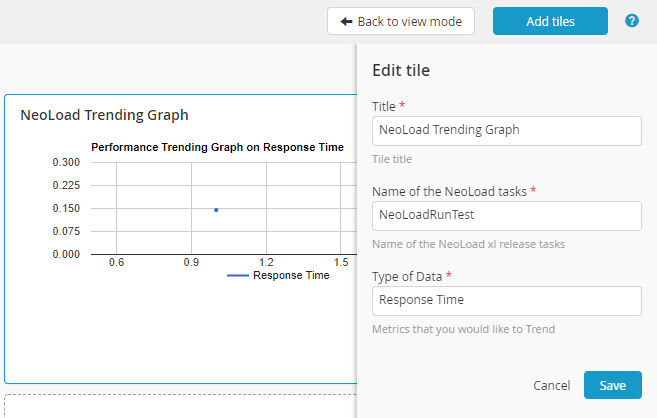

# xlr-neotys-plugin

[![License: MIT][xlr-neotys-plugin-license-image] ][xlr-neotys-plugin-license-url]
[![Github All Releases][xlr-neotys-plugin-downloads-image]]()

[xlr-neotys-plugin-license-image]: https://img.shields.io/badge/License-MIT-yellow.svg
[xlr-neotys-plugin-license-url]: https://opensource.org/licenses/MIT
[xlr-neotys-plugin-downloads-image]: https://img.shields.io/github/downloads/xebialabs-community/xlr-neotys-plugin/total.svg

## Preface

## Overview
NeoLoad plugin for XL release allows the users to launch <a href="https://www.neotys.com/neoload/overview">NeoLoad</a> tests, change variables before launching others tests or generate a <a href="https://www.neotys.com/solutions/cloud-load-testing">Neotys Cloud Session</a>.

NeoLoad launched tests can be sent to <a href="https://www.neotys.com/neoload/features/neoload-web">NeoLoad Web</a> SaaS or On-Premises.

## Tasks
The plugin has 3 different tasks.
#### Launch Test
Launch Test task allows the user to trigger a NeoLoad loading test on a remote machine (Windows, Linux, Mac OS). This task supports all the different ways to store Neoload projects:
<ul>
    <li>On a Neotys Team Server</li>
    <li>On a source control (SVN)</li>
    <li>Locally</li>
</ul>
This task is also compatible with the usage of the new NeoLoad Web platform .

Note: If the user has a NeoLoad Web subscription, the plugin will stream the data to the user's NeoLoad Web account (SaaS or On-Premises).

The task is failing when the SLAs of the test are not met.

The Launch Test task stores 3 report files: report.xml (required for the Trending Tile and Custom Trending Tile), report.pdf and junit.xml.

#### Update Variable
The update variable task allows the user to rewrite the runtime context of a test. The main idea behind this task is to update the project used by "Launch Test task" by updating the reference of the System under test.

If the XL release user is deploying the application on a new environment, he will be able to pass the definition of the environment to NeoLoad through the Update Variable task.

#### Cloud Session
Neotys offers and manages Cloud Platforms.

The users have the ability to spin up Load Generators based on 57 different geographies (Load Generator is the component generating the load to the application).
The users can run test from the expected location of the end users.

The Cloud Session task will allow XL release users to create a cloud session that would be used by the Launch Test task.

Update Variable and Cloud Session tasks are optional.

## Configurations
The plugin has 5 different configurations.

#### NeoLoad Controller
This configuration specifies where NeoLoad Controller is installed and how to access it.

<ul>
    <li>Supported operation systems: Linux, Windows (Telnet), Windows (WinRM), Mac OS. 
        Please refer to <a href="https://docs.xebialabs.com/xl-platform/concept/remoting-plugin.html">Xebia remoting plugin</a> and <a href="https://docs.xebialabs.com/xl-deploy/4.5.x/remotingPluginManual.html">Xebia remoting plugin manual</a> in order to correcly configure the NeoLoad Controller machine.</li>
    <li>Hostname or IP address of the machine where NeoLoad Controller is installed</li>
    <li>NeoLoad installation path in the machine</li>
    <li>Username to accces to the NeoLoad Controller machine</li>
    <li>Password to access to the NeoLoad Controller machine</li>
</ul>
Here is an example of NeoLoad Controller configuration:

#### Neotys Team Server
This configuration specifies Neotys Team Server that allows leasing a NeoLoad license and check out a NTS collaboration project.
<ul>
    <li>Neotys Team Server Url</li>
    <li>Username to accces to Neotys Team Server</li>
    <li>Password to access to Neotys Team Server</li>
    <li>License identifier that NeoLoad Controller will lease when launching a test</li>
</ul>
Here is an example of Neotys Team Server configuration:

#### NeoLoad Web
This configuration specifies NeoLoad Web that allows streaming the launched test to NeoLoad Web SaaS or On-Premises.
<ul>
    <li>NeoLoad Web Api Url</li>
</ul>
Here is an example of NeoLoad Web configuration:

#### NeoLoad Collaboration</h4>
This configuration specifies the SVN third-party collaboration that is used to check out a NeoLoad project.
<ul>
    <li>SVN Server Url</li>
    <li>Username to accces to SVN Server</li>
    <li>Password to access to SVN Server</li>
</ul>

#### NeoLoad Cloud
This configuration specifies the credentials to access Neotys Cloud Platform. This configuration is used for Cloud Session Task.
<ul>
    <li>Username to accces to Neotys Cloud Platform</li>
    <li>Password to access to Neotys Cloud Platform</li>
</ul>

## NeoLoad Release
Here is an example of NeoLoad Release:

## Custom Tiles
The plugin comes with 2 custom tiles.

#### NeoLoad Trending Graph
The user can add to the release dashboard a tile that will trend all the launched tests (having a specific name) on following KPIs:
<ul>
    <li>Average response time</li>
    <li>Errors</li>
    <li>Hit/s</li>
</ul>
Here is an example of NeoLoad Trending Graph:

#### NeoLoad Custom Trending Graph
The user can trend any metrics exposed in NeoLoad report.xml.

The user will specify the XPath query required to collect the KPI from NeoLoad report.xml.

## Installation
Pleas refer to <a href="https://docs.xebialabs.com/xl-release/how-to/install-or-remove-xl-release-plugins.html">How to install a XL Release plugin</a>

## References
<ul>
    <li><a href="https://www.neotys.com/neoload/overview">NeoLoad</a></li>
    <li><a href="https://neoload.saas.neotys.com/">NeoLoad Web</a></li>
    <li><a href="https://www.neotys.com/solutions/cloud-load-testing">Neotys Cloud Platform</a></li>
</ul>
